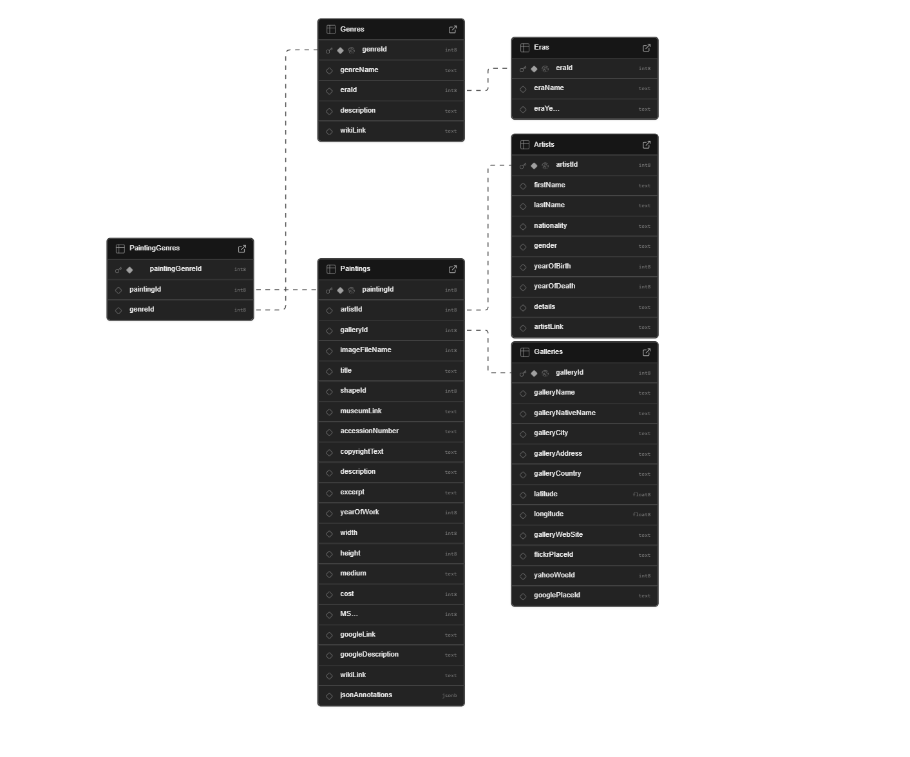

# Web Development III - Assignment 1

> COMP 4513 (Winter 2025) - Assignment 1

[](https://nodejs.org/) [](https://expressjs.com/) [](https://supabase.com/)

## Table of Contents

<details>
<summary>📋 Table of Contents</summary>

### Core Content

- [📝 Overview](#overview)
- [🗂️ Database Schema](#database-schema)
- [🛠️ Built With](#built-with)
- [⚙️ Setup](#setup-local-development)

### API Docs

- [🔍 API Reference](#API-Documentation)
  - [🏛️ Gallery Endpoints](#gallery-endpoints)
  - [👨‍🎨 Artist Endpoints](#artist-endpoints)
  - [🎨 Painting Endpoints](#painting-endpoints)
  - [📑 Genre/Era Endpoints](#genreera-painting-endpoints)
  - [📊 Statistics Endpoints](#statistics-endpoints)
- [💡 Response Format](#response-format)

</details>

## Overview

This repo is an API that uses node.js and express.js to interface with a Supabase DB containing info as per the assignment documentation (art-related) info, which includes;

- Paintings
- Galleries
- Artists
- PaintingGenres
- Genres
- Eras

## Database Schema

<div align="center">
  
  <br/>
  <a href="schema-design-visual.png" target="_blank">
    <button style="padding: 10px 20px; margin-top: 10px; cursor: pointer;">
      Open Schema in New Tab
    </button>
  </a>
</div>

## Built With

### Core Libraries

- `@supabase/supabase-js`
- `express`
- `dotenv`

### Technology Stack

- **Node.JS** - JavaScript runtime environment
- **Express.JS** - Web application framework
- **Supabase** - Database platform
- **Render.com** - Deployment platform

## Setup (Local Development)

1. Clone the repository

```bash
git clone <repository-url>
```

2. Install dependencies

```bash
npm install
```

3. Create a `config.env` file with your Supabase credentials

```env
PROJECT_URL=your_supabase_url
SUPABASE_KEY=your_supabase_key
PORT=3000
```

4. Start the server

```bash
node entry.js
```

# API Documentation

## Endpoints

Note: Endpoints are merely an example, **not** the ones **to be marked**

| Endpoint                              | Description                                                                     | Example                                                                                         |
| ------------------------------------- | ------------------------------------------------------------------------------- | ----------------------------------------------------------------------------------------------- |
| `/api/eras`                           | Returns all the eras                                                            | [Try it](https://comp4513assignment1.onrender.com/api/eras)                                     |
| `/api/galleries`                      | Returns all galleries with all fields                                           | [Try it](https://comp4513assignment1.onrender.com/api/galleries)                                |
| `/api/galleries/:ref`                 | Returns specified gallery by galleryId                                          | [Example: Gallery 30](https://comp4513assignment1.onrender.com/api/galleries/30)                |
| `/api/galleries/country/:substring`   | Returns galleries whose country begins with substring (case insensitive)        | [Example: France](https://comp4513assignment1.onrender.com/api/galleries/country/fra)           |
| `/api/artists`                        | Returns all artists with all fields                                             | [Try it](https://comp4513assignment1.onrender.com/api/artists)                                  |
| `/api/artists/:ref`                   | Returns specified artist by artistId                                            | [Example: Artist 12](https://comp4513assignment1.onrender.com/api/artists/12)                   |
| `/api/artists/search/:substring`      | Returns artists whose last name begins with substring                           | [Example: "Ma"](https://comp4513assignment1.onrender.com/api/artists/search/ma)                 |
| `/api/artists/country/:substring`     | Returns artists whose nationality begins with substring                         | [Example: French](https://comp4513assignment1.onrender.com/api/artists/country/fra)             |
| `/api/paintings`                      | Returns all paintings with complete artist and gallery details, sorted by title | [Try it](https://comp4513assignment1.onrender.com/api/paintings)                                |
| `/api/paintings/sort/:field`          | Returns paintings sorted by title or year                                       | [Sort by Year](https://comp4513assignment1.onrender.com/api/paintings/sort/year)                |
| `/api/paintings/:ref`                 | Returns specified painting with full details                                    | [Example: Painting 63](https://comp4513assignment1.onrender.com/api/paintings/63)               |
| `/api/paintings/search/:substring`    | Returns paintings whose title contains substring                                | [Example: "port"](https://comp4513assignment1.onrender.com/api/paintings/search/port)           |
| `/api/paintings/years/:start/:end`    | Returns paintings between years (inclusive)                                     | [1800-1850](https://comp4513assignment1.onrender.com/api/paintings/years/1800/1850)             |
| `/api/paintings/galleries/:ref`       | Returns paintings in specified gallery                                          | [Example: Gallery 5](https://comp4513assignment1.onrender.com/api/paintings/galleries/5)        |
| `/api/paintings/artist/:ref`          | Returns paintings by specified artist                                           | [Example: Artist 16](https://comp4513assignment1.onrender.com/api/paintings/artist/16)          |
| `/api/paintings/artists/country/:ref` | Returns paintings by artists from specified country                             | [Example: Italian](https://comp4513assignment1.onrender.com/api/paintings/artists/country/ital) |
| `/api/genres`                         | Returns all genres with complete era information                                | [Try it](https://comp4513assignment1.onrender.com/api/genres)                                   |
| `/api/genres/:ref`                    | Returns specified genre with era details                                        | [Example: Genre 76](https://comp4513assignment1.onrender.com/api/genres/76)                     |
| `/api/genres/painting/:ref`           | Returns genres used in specified painting                                       | [Example: Painting 408](https://comp4513assignment1.onrender.com/api/genres/painting/408)       |
| `/api/paintings/genre/:ref`           | Returns basic painting info for specified genre                                 | [Example: Genre 78](https://comp4513assignment1.onrender.com/api/paintings/genre/78)            |
| `/api/paintings/era/:ref`             | Returns basic painting info for specified era                                   | [Example: Era 2](https://comp4513assignment1.onrender.com/api/paintings/era/2)                  |
| `/api/counts/genres`                  | Returns genre names and painting counts (fewest to most)                        | [Try it](https://comp4513assignment1.onrender.com/api/counts/genres)                            |
| `/api/counts/artists`                 | Returns artist names and painting counts (most to fewest)                       | [Try it](https://comp4513assignment1.onrender.com/api/counts/artists)                           |
| `/api/counts/topgenres/:ref`          | Returns genres with more than specified number of paintings                     | [Example: >20 paintings](https://comp4513assignment1.onrender.com/api/counts/topgenres/20)      |

## Response Format

All endpoints return JSON data. Example response from `/api/galleries`:

```json
{
  "galleryId": 2,
  "galleryName": "Prado Museum",
  "galleryNativeName": "Museo del Prado",
  "galleryCity": "Madrid",
  "galleryAddress": "Paseo del Prado, s/n, 28014",
  "galleryCountry": "Spain",
  "latitude": 40.413393,
  "longitude": -3.691953,
  "galleryWebSite": "http://www.museodelprado.es/",
  "flickrPlaceId": "XrSazRhTUrh4j1shyQ",
  "yahooWoeId": 20219885,
  "googlePlaceId": "ChIJ7aLYZp0oQg0RWoitk33wlBA"
}
```

# API Test Links (FOR MARKING)

## Gallery Endpoints

| Endpoint                            | Description                                                              | Test Link                                                                              |
| ----------------------------------- | ------------------------------------------------------------------------ | -------------------------------------------------------------------------------------- |
| `/api/eras`                         | Returns all the eras                                                     | [Try it](https://comp4513assignment1.onrender.com/api/eras)                            |
| `/api/galleries`                    | Returns all galleries with complete field information                    | [Try it](https://comp4513assignment1.onrender.com/api/galleries)                       |
| `/api/galleries/:ref`               | Returns specified gallery using galleryId                                | [Gallery #30](https://comp4513assignment1.onrender.com/api/galleries/30)               |
| `/api/galleries/country/:substring` | Returns galleries whose country begins with substring (case insensitive) | [French Galleries](https://comp4513assignment1.onrender.com/api/galleries/country/fra) |

## Artist Endpoints

| Endpoint                          | Description                                                              | Test Link                                                                                                                                                        |
| --------------------------------- | ------------------------------------------------------------------------ | ---------------------------------------------------------------------------------------------------------------------------------------------------------------- |
| `/api/artists`                    | Returns all artists with complete field information                      | [Try it](https://comp4513assignment1.onrender.com/api/artists)                                                                                                   |
| `/api/artists/:ref`               | Returns specified artist using artistId                                  | [Artist #12](https://comp4513assignment1.onrender.com/api/artists/12)<br>[Invalid: #1223423](https://comp4513assignment1.onrender.com/api/artists/1223423)       |
| `/api/artists/search/:substring`  | Returns artists whose last name begins with substring (case insensitive) | [Search: "ma"](https://comp4513assignment1.onrender.com/api/artists/search/ma)<br>[Search: "mA"](https://comp4513assignment1.onrender.com/api/artists/search/mA) |
| `/api/artists/country/:substring` | Returns artists whose nationality begins with substring                  | [French Artists](https://comp4513assignment1.onrender.com/api/artists/country/fra)                                                                               |

## Painting Endpoints

| Endpoint                              | Description                                                                              | Test Link                                                                                                                                                                                                                                                                    |
| ------------------------------------- | ---------------------------------------------------------------------------------------- | ---------------------------------------------------------------------------------------------------------------------------------------------------------------------------------------------------------------------------------------------------------------------------- |
| `/api/paintings`                      | Returns all paintings with complete artist and gallery information (default sort: title) | [Try it](https://comp4513assignment1.onrender.com/api/paintings)                                                                                                                                                                                                             |
| `/api/paintings/sort/:field`          | Returns all paintings sorted by title or yearOfWork                                      | [Sort by Year](https://comp4513assignment1.onrender.com/api/paintings/sort/year)                                                                                                                                                                                             |
| `/api/paintings/:ref`                 | Returns specified painting with complete details                                         | [Painting #63](https://comp4513assignment1.onrender.com/api/paintings/63)                                                                                                                                                                                                    |
| `/api/paintings/search/:substring`    | Returns paintings with matching title (case insensitive)                                 | [Search: "port"](https://comp4513assignment1.onrender.com/api/paintings/search/port)<br>[Search: "pORt"](https://comp4513assignment1.onrender.com/api/paintings/search/pORt)<br>[Search: "connolly"](https://comp4513assignment1.onrender.com/api/paintings/search/connolly) |
| `/api/paintings/years/:start/:end`    | Returns paintings between years (inclusive), sorted by yearOfWork                        | [Years: 1800-1850](https://comp4513assignment1.onrender.com/api/paintings/years/1800/1850)                                                                                                                                                                                   |
| `/api/paintings/galleries/:ref`       | Returns all paintings in specified gallery                                               | [Gallery #5](https://comp4513assignment1.onrender.com/api/paintings/galleries/5)                                                                                                                                                                                             |
| `/api/paintings/artist/:ref`          | Returns all paintings by specified artist                                                | [Artist #16](https://comp4513assignment1.onrender.com/api/paintings/artist/16)<br>[Invalid: #666](https://comp4513assignment1.onrender.com/api/paintings/artist/666)                                                                                                         |
| `/api/paintings/artists/country/:ref` | Returns paintings by artists from specified country                                      | [Italian Artists](https://comp4513assignment1.onrender.com/api/paintings/artists/country/ital)                                                                                                                                                                               |

## Genre/Era(Painting) Endpoints

| Endpoint                    | Description                                                            | Test Link                                                                                                                                                              |
| --------------------------- | ---------------------------------------------------------------------- | ---------------------------------------------------------------------------------------------------------------------------------------------------------------------- |
| `/api/genres`               | Returns all genres with complete era information                       | [Try it](https://comp4513assignment1.onrender.com/api/genres)                                                                                                          |
| `/api/genres/:ref`          | Returns specified genre with complete era details                      | [Genre #76](https://comp4513assignment1.onrender.com/api/genres/76)                                                                                                    |
| `/api/genres/painting/:ref` | Returns genres used in specified painting (sorted by genreName)        | [Painting #408](https://comp4513assignment1.onrender.com/api/genres/painting/408)<br>[Invalid ID](https://comp4513assignment1.onrender.com/api/genres/painting/jsdfhg) |
| `/api/paintings/genre/:ref` | Returns basic painting info for specified genre (sorted by yearOfWork) | [Genre #78](https://comp4513assignment1.onrender.com/api/paintings/genre/78)                                                                                           |
| `/api/paintings/era/:ref`   | Returns basic painting info for specified era (sorted by yearOfWork)   | [Era #2](https://comp4513assignment1.onrender.com/api/paintings/era/2)                                                                                                 |

## Statistics Endpoints

| Endpoint                     | Description                                                 | Test Link                                                                                                                                                                       |
| ---------------------------- | ----------------------------------------------------------- | ------------------------------------------------------------------------------------------------------------------------------------------------------------------------------- |
| `/api/counts/genres`         | Returns genre names and painting counts (fewest to most)    | [Try it](https://comp4513assignment1.onrender.com/api/counts/genres)                                                                                                            |
| `/api/counts/artists`        | Returns artist names and painting counts (most to fewest)   | [Try it](https://comp4513assignment1.onrender.com/api/counts/artists)                                                                                                           |
| `/api/counts/topgenres/:ref` | Returns genres with more than specified number of paintings | [>20 Paintings](https://comp4513assignment1.onrender.com/api/counts/topgenres/20)<br>[Invalid: #2034958](https://comp4513assignment1.onrender.com/api/counts/topgenres/2034958) |
